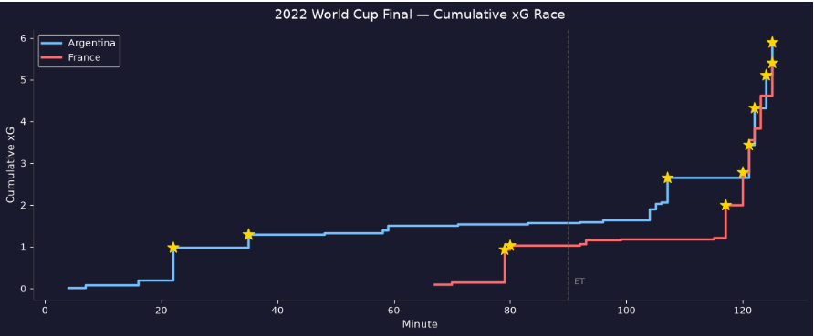

# Argentina vs France — FIFA World Cup Final 2022

## Project Overview

This project analyzes the 2022 FIFA World Cup Final using StatsBomb Open Data and Python.

The objective was to investigate whether Argentina's victory was supported by underlying chance creation and shot quality metrics.

## Tools Used

- Python
- Pandas
- StatsBombPy
- mplsoccer
- Matplotlib

## Key Findings

- Argentina controlled chance creation for most of the match.
- France generated very little attacking threat before Mbappé's late surge.
- The cumulative xG race highlights how quickly the game state changed in the final stages.

## Visualizations

### Shot Map

### xG Race

## Notebook

[Open Analysis Notebook](2022%20Argentina%20Vs%20France%20WC.ipynb)

## Data Source

StatsBomb Open Data
